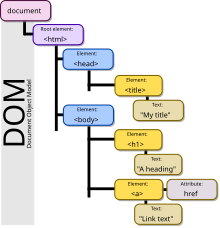

# Manejo del DOM HTML con JavaScript



---

El manejo del DOM (Document Object Model) HTML con JavaScript se refiere a la capacidad de interactuar y manipular dinámicamente la estructura, contenido y estilo de una página web utilizando código JavaScript. El DOM es una representación en forma de árbol de todos los elementos de un documento HTML.

Aquí te explico los aspectos clave del manejo del DOM con JavaScript:

1. Selección de elementos:

   JavaScript puede seleccionar elementos HTML de varias maneras:

   ```javascript
   // Por ID
   const elemento = document.getElementById("miId");

   // Por clase
   const elementos = document.getElementsByClassName("miClase");

   // Por etiqueta
   const parrafos = document.getElementsByTagName("p");

   // Usando selectores CSS (más versátil)
   const elemento = document.querySelector("#miId");
   const elementos = document.querySelectorAll(".miClase");
   ```

2. Modificación del contenido:

   Puedes cambiar el contenido de los elementos:

   ```javascript
   elemento.textContent = "Nuevo texto";
   elemento.innerHTML = "<strong>Nuevo HTML</strong>";
   ```

3. Modificación de atributos:

   ```javascript
   elemento.setAttribute("class", "nuevaClase");
   elemento.id = "nuevoId";
   ```

4. Modificación de estilos:

   ```javascript
   elemento.style.color = "red";
   elemento.style.fontSize = "20px";
   ```

5. Creación y eliminación de elementos:

   ```javascript
   // Crear
   const nuevoElemento = document.createElement("div");
   nuevoElemento.textContent = "Nuevo elemento";
   document.body.appendChild(nuevoElemento);

   // Eliminar
   elementoPadre.removeChild(elementoHijo);
   // o
   elemento.remove();
   ```

6. Manejo de eventos:

   ```javascript
   elemento.addEventListener("click", function () {
     console.log("Elemento clickeado");
   });
   ```

7. Navegación por el DOM:

   ```javascript
   const padre = elemento.parentNode;
   const primerHijo = elemento.firstChild;
   const siguienteHermano = elemento.nextSibling;
   ```

8. Modificación de clases:

   ```javascript
   elemento.classList.add("nuevaClase");
   elemento.classList.remove("viejaClase");
   elemento.classList.toggle("claseAlterna");
   ```

9. Obtención y modificación de formularios:

   ```javascript
   const formulario = document.forms["miFormulario"];
   const valorInput = formulario.elements["miInput"].value;
   ```

10. Manipulación de atributos data:

    ```javascript
    const valor = elemento.dataset.miAtributo;
    elemento.dataset.nuevoAtributo = "valor";
    ```

Ejemplo práctico:

```javascript
document.addEventListener("DOMContentLoaded", () => {
  const boton = document.querySelector("#miBoton");
  const parrafo = document.querySelector("#miParrafo");

  boton.addEventListener("click", () => {
    parrafo.style.color = "blue";
    parrafo.textContent = "El texto ha cambiado";

    const nuevoElemento = document.createElement("p");
    nuevoElemento.textContent = "Nuevo párrafo añadido";
    document.body.appendChild(nuevoElemento);
  });
});
```

Este ejemplo espera a que el DOM esté completamente cargado, luego selecciona un botón y un párrafo, y añade un evento de clic al botón que cambia el color y el texto del párrafo, y añade un nuevo párrafo al documento.

El manejo del DOM es fundamental para crear páginas web interactivas y dinámicas, permitiendo a los desarrolladores modificar la página en respuesta a las acciones del usuario o a otros eventos.
